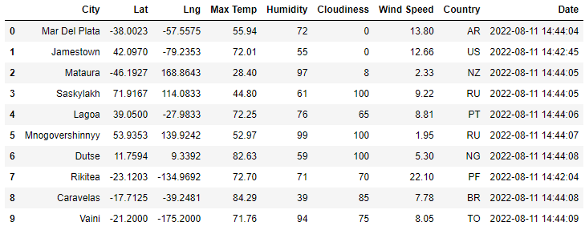
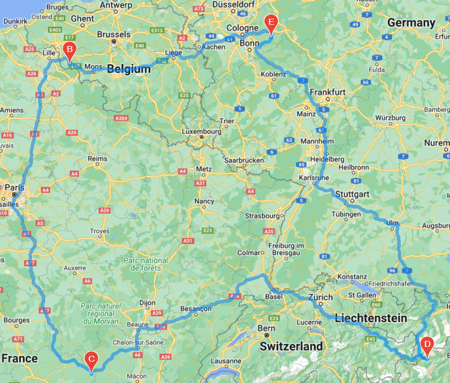
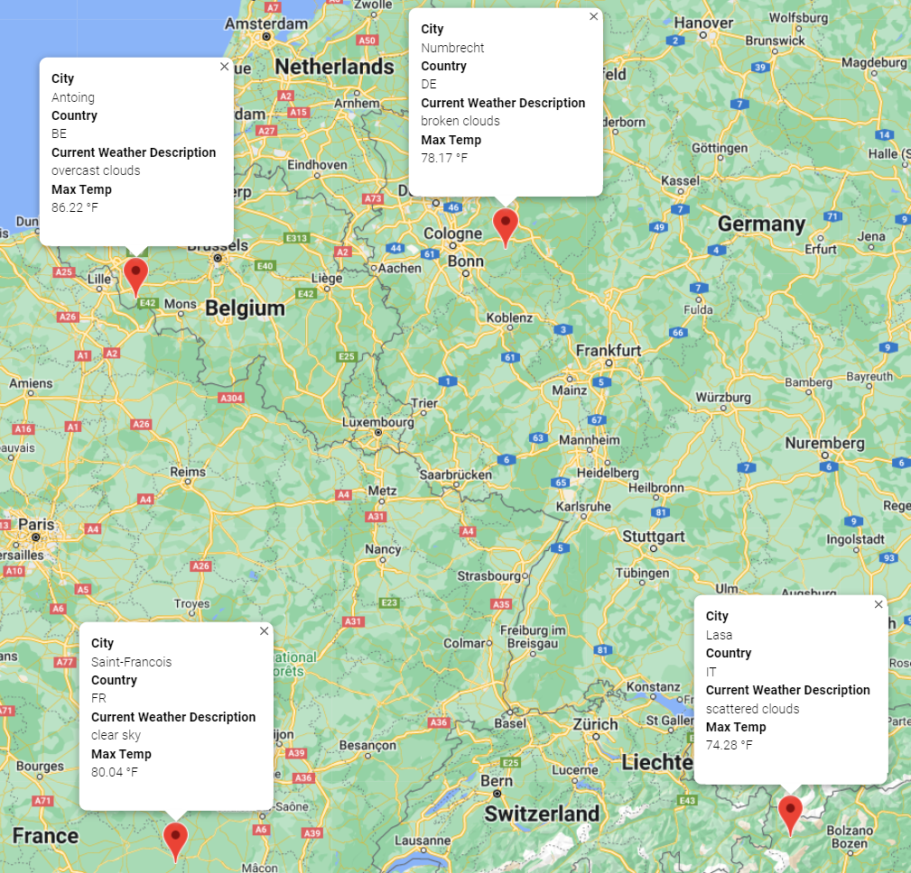

# Creating a weather database and a trip itinerary using APIs

## Purpose & Background
I learned how to make API calls through the [OpenWeather Database](https://openweathermap.org/) and through the [Google Maps Platform](https://mapsplatform.google.com/). I learned to make these calls in order to create a database of recent (current at the time of running the program) weather data, and from there make API calls to create graphs of weather data trends, map plot-points, and create a visual traveling itinerary. 

I first gathered weather data using the OpenWeather Database. I randomly generated latitude and longitude coordinates and used [CitiPy](https://github.com/wingchen/citipy) to find the cities that were nearest to the coordinates that were generated. I made API calls through the OpenWeather Database to find information about a range of different cities that I generated: 
- latitude and longitude coordinates, 
- country codes, 
- max/min temps for the day, 
- current weather conditions, 
- humidity %, 
- cloudiness %, 
- and windspeed. 

Then, I was able to use the Pandas library to make dataframes that housed this data and then clean the data of any rows that did not contain values. I was able to make scatter-plots of this data to find trends between the latitude coordinates and humidity, cloudiness, temperatures, etc. Later, I used a few of the Google Maps Platform APIs which allowed us to make heatmap layers showcasing some of this data, generate a layer to plot points on a map of where the cities were located, as well as make small cards of information using HTML that would show when you click on one of the plotted cities. That lead me to adding another layer of depth to the "PlanMyTrip" app, _which gives the user a round trip, visual and interative itinerary_. 

I created an app called __PlanMyTrip__. 

Here is how the app works:
1. Use the weather database that I created,
2. the app will take the user's input of what they want the maximum and minimum temperatures of their vacation destination to be,
3. a table of cities and their weather data will be generated matching those temperature conditions,
4. the user can choose from 4 cities - in driving, cycling, or walking proximity - and specify which cities are the starting point, ending point, and stopping points,
5. the app will generate a specific route to take through the cities and return to the start point.

